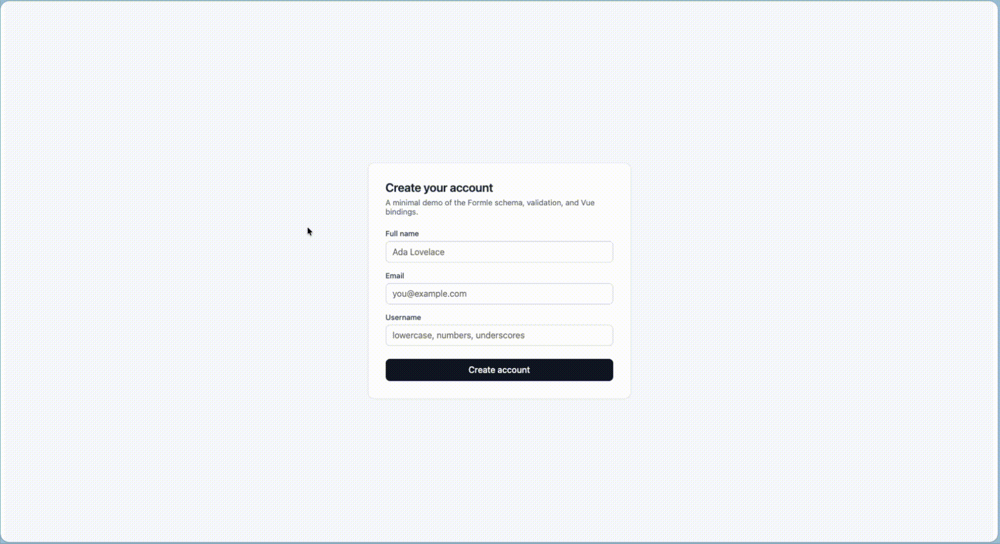
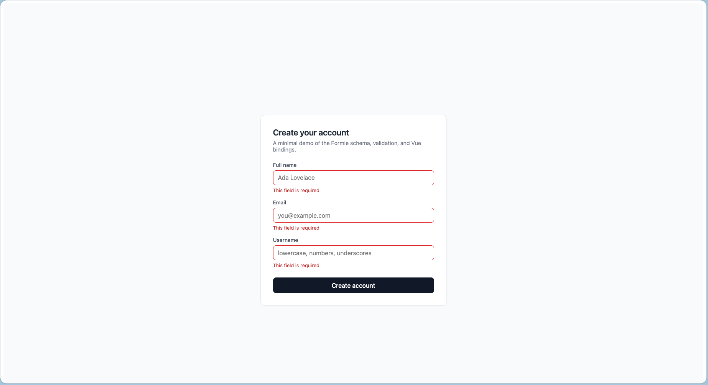

# Formle

[](https://www.npmjs.com/package/@formle/core)
[](https://www.npmjs.com/package/@formle/vue)
[](./LICENSE)
[](https://github.com/ladown/formle/actions/workflows/ci.yml)

Headless, schema-driven form library for Vue 3 with first-class support for server-driven schemas.

## Why Formle

The Vue ecosystem has good form libraries — but most assume the schema lives in your code. Formle is built around a different assumption: **schemas are data, and data can come from anywhere**, including a backend response.

This makes Formle a natural fit for:

- Admin panels and CRMs with user-configurable forms
- Compliance and KYC flows where forms change without redeployment
- Multi-tenant SaaS where each tenant defines custom fields
- Dynamic surveys and questionnaires
- Any product where forms are content, not code

You can still write schemas in TypeScript — that path is fully supported and recommended for most use cases. Server-driven is an additional capability, not a replacement.

## Screenshots



_End-to-end flow: render, validate, submit._


_Empty form — composed via `useForm` and `useField`._



_Validation errors after submitting an empty form._


_Successful submission with values echoed back._

## Design principles

- **Headless** — Formle provides state, validation, and lifecycle. Rendering is yours.
- **Server-driven first-class** — a schema from your API renders a working form, no codegen required.
- **TypeScript DX** — full type inference from schema to submit handler. Nothing is `unknown`.
- **No magic** — every behaviour is explicit. No hidden global state, no auto-imports.

## Architecture

Formle is a monorepo of two published packages:

- **`@formle/core`** — framework-agnostic core (schema parsing, validation engine, form state)
- **`@formle/vue`** — Vue 3 adapter (composables, components, slot-based rendering)

Future adapters (React, Svelte) will follow the same pattern. See `docs/ARCHITECTURE.md`.

## Install

```sh
pnpm add @formle/core @formle/vue
```

## Quick preview

A schema is plain data — `version`, an ordered `fields` array, and per-field
validation rules. `useForm` turns it into reactive state; `useField` binds one
field to your own markup. No styles ship with the library.

```vue
<!-- CreateAccount.vue -->
<script setup lang="ts">
import type { FormSchema, FormValues } from "@formle/core";
import { useForm } from "@formle/vue";
import { ref } from "vue";
import FieldRow from "./FieldRow.vue";

const schema: FormSchema = {
  version: "1",
  id: "create-account",
  fields: [
    {
      id: "fullName",
      type: "text",
      label: "Full name",
      validation: { required: true, minLength: 2 },
    },
    {
      id: "email",
      type: "email",
      label: "Email",
      validation: { required: true },
    },
    {
      id: "password",
      type: "password",
      label: "Password",
      validation: { required: true, minLength: 8 },
    },
  ],
};

const submitted = ref<FormValues | null>(null);

const form = useForm({
  schema,
  onSubmit: async (values) => {
    submitted.value = { ...values };
  },
});
</script>

<template>
  <form novalidate @submit.prevent="form.handleSubmit()">
    <FieldRow
      v-for="field in schema.fields"
      :key="field.id"
      :field="field"
      :form="form"
    />
    <button type="submit" :disabled="form.isSubmitting.value">
      {{ form.isSubmitting.value ? "Creating…" : "Create account" }}
    </button>
  </form>
</template>
```

```vue
<!-- FieldRow.vue — one field, your markup -->
<script setup lang="ts">
import type { Field } from "@formle/core";
import { useField, type UseFormReturn } from "@formle/vue";
import { computed } from "vue";

const props = defineProps<{ field: Field; form: UseFormReturn }>();
const { attrs, error } = useField(props.field.id, props.form);

// You pick the HTML input type from the schema's field type — Formle is headless.
const inputType = computed(() =>
  props.field.type === "email" || props.field.type === "password"
    ? props.field.type
    : "text",
);
</script>

<template>
  <label :for="field.id">{{ field.label }}</label>
  <input
    :id="field.id"
    :type="inputType"
    v-bind="attrs"
    :placeholder="field.placeholder"
  />
  <p v-if="error !== null">{{ error.message }}</p>
</template>
```

`useForm` returns `fields`, `errors`, `handleSubmit`, `isSubmitting`,
`isValid`, `reset`, and the reactive `values`. A full working version lives in
[`examples/basic`](./examples/basic).

### Server-driven path

The same `useForm` accepts a schema fetched at runtime — no codegen, no
redeploy when the form changes:

```ts
import { parseSchema } from "@formle/core";
import { useForm } from "@formle/vue";

const schema = parseSchema(
  await fetch("/api/forms/signup").then((r) => r.json()),
);
const form = useForm({ schema, onSubmit });
```

## Documentation

| Topic                     | File                                           |
| ------------------------- | ---------------------------------------------- |
| What's in v0.1.0          | [docs/ROADMAP.md](./docs/ROADMAP.md)           |
| Schema format spec        | [docs/SCHEMA_SPEC.md](./docs/SCHEMA_SPEC.md)   |
| Architecture and packages | [docs/ARCHITECTURE.md](./docs/ARCHITECTURE.md) |
| Toolchain                 | [docs/TOOLING.md](./docs/TOOLING.md)           |
| Contributing              | [CONTRIBUTING.md](./CONTRIBUTING.md)           |

## License

MIT — see [LICENSE](./LICENSE).
